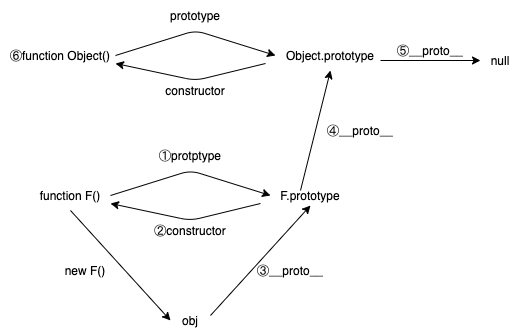
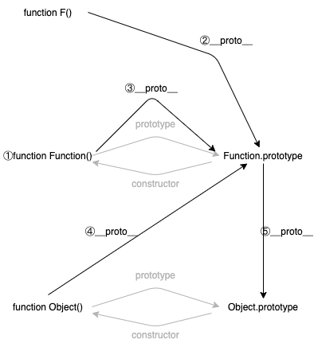

### 描述一下原型链

在JavaScript中，对象中，均有一个\_\_proto\_\_对象指向其原型对象，新创建的没指定原型对象的对象，他们的原型都是Object，而Object的\_\_proto\_\_则是null，对象可以通过Object.getPrototypeOf()来获取其原型对象。当为了访问某个对象的某个属性或者某个方法的时候，首先会在其自身的属性中找，如果没有找到，则会沿着原型链上的对象去找，如果找到，则返回，如果一直到null都没有找到，则不存在改属性或者方法。

在理解原型链的时候很容易受到影响的是方法中的prototype属性，prototype只是方法中才有的属性。


####一、通过一个简单的例子来理解这个概念。

```
function F(){} // 先定义一个F方法
let obj = new F(); // 通过new的方式生成一个F的实例，obj
```

在这里例子中，先生成了一个**方法F**，这个方法会有一个它的原型对象。

①通过F去访问它的prototype，则会得到**F.prototype**，是F的原型对象。

②而这个原型对象的构造函数就是F本身，F.prototype.constructor指向**方法F**。

③在生成的**obj**对象中，有一个\_\_proto\_\_属性，指向**F.prototype**，则obj是属于**F.prototype**的实例。表示**obj**的原型是**F.prototype**

④**F.prototype**这个本身是一个对象，则它也有原型对象，即**Object.prototype**，因为没有显式将**方法F**从哪个对象继承而来，所以F将继承自Object。

⑤**Object.prototype**的\_\_proto\_\_则是null。

⑥这里的**Object**其实是指的方法，这里的原型和构造函数的逻辑跟**方法F**的一样，可以参照一下。Object本身可以使用new进行实例化。



#### 二、接下来理解一下更深一点的内容。可能会有点绕，但是仔细理解能理解得来。

但是我们不再关注obj了，而是关注**方法F**、**方法Function**、**方法Object**。在JavaScript中，方法也是对象，此图中灰色的概念可以通过上方的内容了解。在接下来的内容中，将会把这些所有的方法主要当做对象来看待。

①这里先理解一下**方法Function**。

```javascript
let F = new Function(); // 通过new 实例化Function，
F(); // undefined
new F(); // {}
```

使用new对Function进行实例化可以生成一个**方法F**，此处执行为空，可以通过参数传入方法中的逻辑，不是这里重点讨论不做演示。

②也即是**方法F**是Function实例化的对象(也是方法)，那这里的**方法F**的\_\_proto\_\_将会指向**Function.protptype**。

③很自然地想到了，**方法Function**本身也是一个对象，那么它本身也有\_\_proto\_\_属性，也将指向**Function.protptype**

```javascript
Function.__proto__ === Function.prototype // true
```

④接下来是**方法Object**，很自然的，这是一个方法，也是对象，其\_\_proto\_\_属性也自然是指向了**Function.prototype**。

⑤因为**Function.prototype**本身是属于一个对象，所以它本质上也是继承自Object的，所以其\_\_proto\_\_属性将会是**Object.prototype**




####三、ES6中使用了class，则是ES5中原型链的一个语法糖。

[详细的例子](https://developer.mozilla.org/zh-CN/docs/Web/JavaScript/Inheritance_and_the_prototype_chain)


ES5继承的实现，需要注意构造器的重新指向，以及父类构造方法的调用

```javascript
function Person(name, gender, age){ // 定义一个方法，即类
  this.name = name;
  this.gender = gender;
  this.age = age;
}
Person.prototype.greeting = function(){ // 将方法挂在方法的原型上，在实例方法的时候会拿到这里的方法去执行
  console.log(`Hi, I am ${this.name}`);
}
Person.prototype.working = function(){
  console.log(`I have no work now`);
}

function Programmer(name, gender, age, language){
  Person.call(this, name, gender, age); // 此处需要先执行父类的方法，才能拿到父类中定义的属性
  this.language = language;
}

Programmer.prototype = Object.create(Person.prototype); // 创建一个父类的对象，让Programmer
Programmer.constructor = Programer;

Programmer.prototype.working = function(){
  console.log(`I am a programmer, I use ${this.language}`)
}

let programmer = new Programmer('Jerry', 'female', 22, 'JavaScript');
programmer.greeting() //  Hi, I am Jerry
programmer.working() //  I am a programmer, I use JavaScript
```

ES6的继承方式，两种方式得到的结果一致。

```javascript
class Person{
  constructor(name, gender, age){
    this.name = name;
    this.gender = gender;
    this.age = age;
  }
  greeting = function(){
    console.log(`Hi, I am ${this.name}`);
  }
  working = function(){
    console.log(`I have no work now`);
  }
}

class Programmer extends Person{
  constructor(name, gender, age, language){
    super(name, gender, age);
    this.language = language;
  }
  working = function(){
    console.log(`I am a programmer, I use ${this.language}`)
  }
}
```

[继承的官方文档](https://developer.mozilla.org/zh-CN/docs/Learn/JavaScript/Objects/Inheritance)